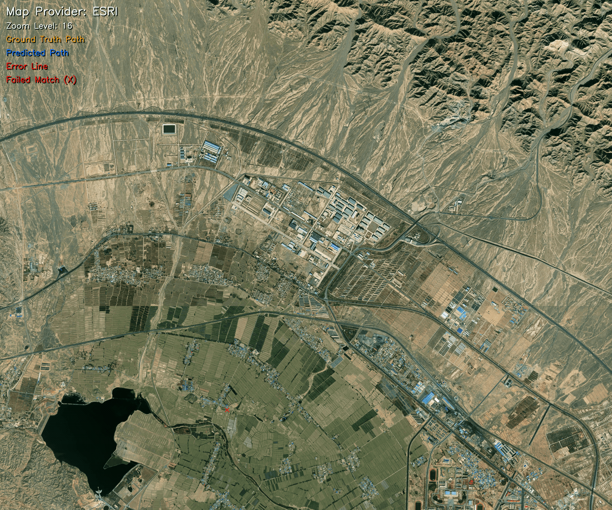
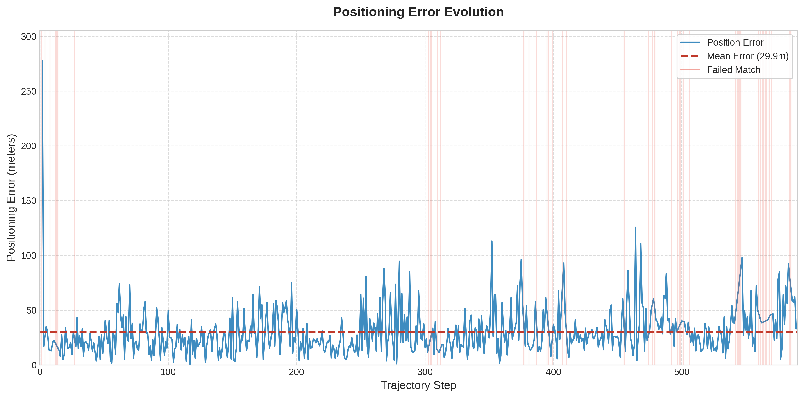

# Aerial Positioning: Visual Positioning for Aerial Imagery Using Pre-existing Satellite Images 
*Capstone Project | B.Sc. in Astronautical Engineering*

A robust vision-based positioning pipeline designed as a complementary aiding source for inertial navigation systems (INS) in GNSS-denied environments. The system estimates the horizontal position (latitude and longitude) of an aerial vehicle by matching onboard camera imagery with publicly available satellite map tiles. The resulting position estimates are used to periodically correct INS drift, preventing the accumulation of long-term positioning errors. To enable reliable cross-view matching, the pipeline leverages vehicle attitude information to warp oblique camera views into a nadir (top-down) perspective aligned with satellite imagery.

<p align="center">
  
  <br>
  <i>GNSS-Free Coordinate Estimation: Ground Truth (Orange) vs. Estimated Position (Blue)</i>
</p>

## Table of Contents
- [Features](#features)
- [Installation](#installation)
- [Dataset Setup](#dataset-setup)
- [Usage](#usage)
- [Configuration](#configuration)
- [Methodology](#methodology)
- [Future Enhancements](#future-enhancements)
- [References & Acknowledgments](#references--acknowledgments)

## Features

*   **Perspective Warping:** Automatically corrects aerial vehicle tilt (Pitch/Roll) and heading (Yaw) using gimbal telemetry to align oblique aerial footage with top-down satellite maps.
*   **Robust Geometric Validation:** Multi-stage filtering process using RANSAC and physical plausibility checks to ensure high-confidence positioning even in complex environments.
*   **INS/Odometry Simulation:** Leverages displacement prediction to constrain the search space based on the vehicle's movement, dramatically increasing matching speed and robustness in GNSS-denied scenarios.
*   **Adaptive Radius Search:** Automatically increases search radius (1000m → 2000m → 3000m) on matching failures to maximize success rate.
*   **Deep Matching Suite:** Full integration of state-of-the-art matchers (LightGlue, LoFTR, SuperGlue, GIM, and MINIMA) for cross-domain robustness.
*   **Multi-Provider Tile Engine:** Automated geodetic bounding box retrieval and tile stitching from ESRI, Google, and Bing Maps with accurate Mercator projection handling.

## Installation

```bash
# Clone with submodules
git clone --recursive https://github.com/hamitbugrabayram/AerialPositioning.git
cd AerialPositioning

# Setup environment
conda create -n aerialpos python=3.9 -y && conda activate aerialpos
pip install -r requirements.txt

# Download Matcher Weights (Example for MINIMA)
cd matchers/MINIMA/weights && bash download.sh && cd ../../..
```

## Dataset Setup

The pipeline is tested with the **UAV-VisLoc** dataset but supports any georeferenced aerial imagery. For another data check the UAV-VisLoc dataset format!

1.  **Extract Data**: Download UAV-VisLoc dataset.
    ```bash
    unzip UAV_VisLoc_dataset.zip -d _VisLoc_dataset
    ```
2.  **Initialize Central Storage**:
    ```bash
    # Prepare all regions for evaluation across multiple providers and zooms
    python runner.py --dataset-prepare all --zoom-levels 16 17 --tile-provider esri google
    ```
3.  **Unified Structure**:
    ```
    datasets/
    ├── 01_Changjiang_20/
    │   ├── query/                # Global drone images and unified metadata
    │   └── map/
    │       ├── esri/
    │       │   └── 16/           # Cached satellite tiles
    │       └── google/
    ├── ...
    ```

## Usage

The `runner.py` script manages the end-to-end evaluation workflow.

### 1. Dataset Preparation
Fetches satellite tiles and organizes the central data storage.
```bash
python runner.py --dataset-prepare all --zoom-levels 16 17 --tile-provider esri
```

### 2. Visual Positioning13 B

Executes the main positioning pipeline using displacement vector prediction. Every frame is processed with adaptive radius search (1000m → 2000m → 3000m).
```bash
# Run visual positioning for Region 11
python runner.py --dataset-eval 11 --zoom-levels 16 --tile-provider esri
```

### 3. Reporting
Generates a consolidated Markdown report from the `results/` folder.
```bash
python runner.py --eval-summary all
```
Open `results_report.md` to see the performance metrics and visual tracks.

## Configuration

All system parameters are centralized in `config.yaml`. You can configure the following settings:
*   **Matcher Selection:** Switch between `gim`, `lightglue`, `loftr`, etc.
*   **Model Weights:** Specify paths to different weights of the selected model.
*   **Positioning Parameters:** Adjust `reproj_threshold`, `confidence`, `min_inliers_for_success`, and `max_iter` for geometric verification under `positioning_params`.

## Results

The following table summarizes the performance of the visual positioning system on Region 11 (Shandan) using the GIM (LightGlue) matcher. The system processes every frame with adaptive radius search.

| Region (ID) | Provider | Zoom | Success Rate | Avg Error | Avg Inliers |
| :--- | :--- | :--- | :--- | :--- | :--- |
| **Shandan (11)** | **ESRI** | **16** | **92.20%** | **29.87m** | **495.0** |

### Positioning Error Evolution
<p align="center">
  
</p>

### Key Insights
*   **Frame-by-Frame Processing:** Every frame is processed with GT-Pred comparison for accurate trajectory visualization.
*   **Adaptive Radius Search:** On matching failure, the system automatically increases search radius (1000m → 2000m → 3000m) before skipping a frame.
*   **Search Window Efficiency:** By simulating an INS with Displacement Prediction, the search window is effectively constrained. Even if a frame fails to match, the system predicts the next window correctly.
*   **Dual Path Visualization:** Output visualizations show both GT path (orange) and Predicted path (blue) with error lines connecting each pair.

## Methodology

### Offline: Modular Tile Retrieval Engine
Maps are pre-downloaded offline before a run. A decoupled tile retrieval engine supports multiple providers (Bing Maps QuadKey, OpenStreetMap-compatible XYZ) so that high-resolution satellite tiles for the region of interest can be cached in advance and served without live network access during positioning.

### 1. Perspective Warping (Nadir Transformation)
Oblique UAV imagery is rectified to a nadir (top-down) view so that it is geometrically comparable to ortho-rectified satellite tiles. The warp homography is derived from camera intrinsics $K$ and vehicle attitude $R_{AV}$ (roll, pitch, yaw), with a target rotation $R_{nadir}$ aligning the view to the world vertical:
$$H_{warp} = K \cdot R_{AV}^T \cdot R_{nadir} \cdot K^{-1}$$
Adaptive yaw chooses the in-plane rotation that minimizes resampling artifacts and keeps the field of view well within the image bounds.

### 2. Displacement Prediction (INS / Dead-Reckoning Simulation)
The next search window is predicted by propagating the last visual fix with the displacement vector (from consecutive pose/position estimates), simulating a simple INS/odometry dead-reckoning step. Visual fixes then act as periodic corrections that reset accumulated drift. If matching fails, adaptive radius search (1000 m → 2000 m → 3000 m) widens the search area before discarding the frame.

### 3. Dense Matching & RANSAC
Dense or semi-dense correspondences are computed with deep transformer-based matchers (e.g. LoFTR, GIM). A planar homography $H$ between query and reference tile is estimated via RANSAC from these matches. Acceptance is gated by stability checks: determinant constraint ($|\det H| \approx 1$) for near-rigid motion and boundary constraints so projected corners remain within the image and the solution is non-degenerate.

## Future Enhancements
*   **Full EKF Integration:** Tightly/loosely coupled fusion of visual position fixes with IMU (gyro, accelerometer) and barometric altitude in a single state estimate; prediction from motion model, correction from vision and baro observations.
*   **Adaptive Zoom Selection:** Automatic tile pyramid zoom-level selection from altitude and camera intrinsics to match Ground Sample Distance (GSD) and keep scale consistency for matching.
*   **Model Optimization & Edge Deployment:** Quantization, pruning, and export to runtimes (e.g. ONNX, TensorRT) for low-latency inference on embedded/edge hardware (Jetson, Coral, etc.).


## References & Acknowledgments
1.  **[UAV-VisLoc Dataset](https://github.com/IntelliSensing/UAV-VisLoc):** Dataset source.
2.  **[WildNav](https://github.com/TIERS/wildnav):** Visual navigation concept.
3.  **[Visual Localization](https://github.com/TerboucheHacene/visual_localization):** Vision-based GNSS-Free localization for UAVs in the wild concept.
4.  **Deep Matchers:** [GIM](https://github.com/xuelunshen/gim), [LightGlue](https://github.com/cvg/LightGlue), [LoFTR](https://github.com/zju3dv/LoFTR), [MINIMA](https://github.com/LSXI7/MINIMA).
5.  **Satellite Imagery Providers:** ESRI World Imagery, Google Maps, Bing Maps.

---
*Developed as a B.Sc. Graduation Project.*
