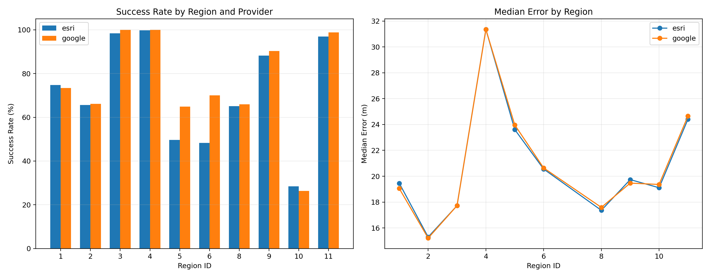

# Aerial Positioning: Visual Positioning for Aerial Imagery Using Pre-existing Satellite Images
*Developed as a Capstone Project | B.Sc. in Astronautical Engineering*

This repository presents a vision-based positioning process for estimating the horizontal position (latitude and longitude) of an aerial platform in GNSS-denied environments. Given only an initial starting position, the method matches onboard imagery against pre-existing satellite map tiles to produce coordinate estimates purely from visual information. To improve cross-view consistency, the process uses aerial vehicle attitude information to rectify oblique camera views into a nadir-oriented perspective aligned with satellite imagery.

<div align="center">
  <video src="https://github.com/user-attachments/assets/0a3b3890-8481-44be-b594-5c120c62d465" width="100%" autoplay muted loop playsinline controls>
    Your browser doesn't support playing the video.
  </video>
</div>

## Table of Contents
- [Environment Setup and Usage](#environment-setup-and-usage)
- [Methodology](#methodology)
- [Evaluation Setup](#evaluation-setup)
- [Results](#results)
- [Limitations and Future Work](#limitations-and-future-work)
- [References & Acknowledgments](#references--acknowledgments)

## Environment Setup and Usage

### 1. Environment Setup

Use Python 3.9 with dependencies from `requirements.txt`. For complete matcher support, clone with `--recursive` and download the required model weights.

### 2. Dataset and Directory Layout

The default setup uses the **[UAV-VisLoc dataset](https://github.com/IntelliSensing/UAV-VisLoc)**. After downloading the archive, extract raw data under `_VisLoc_dataset/` by running:

```bash
unzip UAV_VisLoc_dataset.zip -d _VisLoc_dataset
```

Then run the preparation step to build unified region folders under `datasets/`.

Expected layout after preparation:

```text
datasets/
├── 01_Changjiang_20/
│   ├── query/                
│   └── map/
│       ├── esri/
│       │   └── 16/
│       └── google/
├── ...
```

### 3. Standard Evaluation Commands

```bash
# Prepare all regions (both providers)
python runner.py --dataset-prepare all --tile-provider google esri

# Evaluate selected region(s)
python runner.py --dataset-eval 5 --tile-provider google esri

# Optional: force a specific zoom
python runner.py --dataset-eval 11 --zoom-levels 16 --tile-provider google esri

# Sync missing tiles with a larger map margin (meters)
python runner.py --dataset-prepare 1 2 5 11 --tile-provider google esri --map-margin 5000

# Aggregate reports
python runner.py --eval-summary all
```

`--zoom-levels` is optional for both prepare and eval. If omitted, `runner.py` computes an optimal zoom from each region's median altitude and latitude. During eval, if that zoom is not available on disk, the nearest downloaded zoom is used.

## Methodology

### Pipeline Overview
*   **Offline Tile Retrieval:** A multi-provider retrieval module pre-downloads and caches georeferenced tiles (ESRI/Google) before runtime.
*   **Query Preprocessing:** Drone images are resized and perspective-warped to a nadir, north-oriented view using only onboard IMU/gimbal sensor readings (roll, pitch, yaw).
*   **Adaptive Tile Stitching:** Neighbouring satellite tiles are composed into an NxN grid based on barometric altitude and zoom level so the reference image covers the drone's estimated ground footprint.
*   **INS-Guided Adaptive Search:** A simulated INS propagates the search center along the drone's trajectory using GT-derived displacement vectors (proxy for IMU dead-reckoning) with per-step Gaussian drift. Each frame is tried once; on failure it is skipped (+200 m radius penalty); on success the INS snaps to the visual fix and the radius resets.
*   **Deep Matching and Geometric Validation:** Transformer-based correspondences are validated through RANSAC and geometric plausibility constraints.

### 1. Offline Tile Retrieval
Satellite maps are downloaded offline prior to execution. A decoupled tile retrieval engine supports multiple providers (ESRI, Google), enabling high-resolution tiles for the region of interest to be cached in advance and served without live network access during positioning.

### 2. Query Preprocessing (Perspective Rectification)
Oblique UAV imagery is rectified to a nadir (top-down), north-facing view to establish geometric comparability with ortho-rectified satellite tiles.

The preprocessing pipeline uses **only onboard sensor data** (no GNSS/GT coordinates):

1. **Resize** to a standard dimension (max 768px).
2. **Perspective warp** using gimbal angles from the IMU:
   - **Yaw** (Phi1): heading direction from the gimbal encoder.
   - **Pitch**: elevation angle from the gimbal encoder.
   - **Roll**: bank angle from the gimbal encoder.

The intrinsic matrix $K$ is estimated from image dimensions ($f = \max(w, h)$, principal point at center) since real camera intrinsics are not available in the dataset. The warp homography is:

$$H_{warp} = K \cdot R_{current}^T \cdot R_{nadir} \cdot K^{-1}$$

where $R_{current}$ is built from the gimbal Euler angles and $R_{nadir}$ targets a straight-down, north-aligned view ($\text{pitch} = -90°$, $\text{yaw} = 0°$, $\text{roll} = 0°$).

### 3. Adaptive Tile Stitching
A single 256x256 satellite tile may not cover the drone's full field of view, especially at high altitudes. The engine computes an adaptive grid size from:

- **Barometric altitude** and a coverage factor.
- **Map tile latitude** (from the tile's own georeferencing).
- **Zoom level** (determines tile ground resolution).

$$
g = \min\!\left(\left\lceil \frac{h\,c}{t}\right\rceil,\; g_{\max}\right)
$$

where $h$ is altitude, $c$ is coverage factor, $t$ is tile ground coverage, and
$g_{\max}$ is the configured maximum grid size.

With `max_grid=3`, the composite is 768x768 px (3x3 tiles), which matches the matcher's internal resize target and preserves detail. Missing edge tiles are filled with neutral gray.

### 4. Automatic Zoom Selection
When `--zoom-levels` is omitted, zoom is selected automatically with:

$$
z_{\mathrm{base}} = \left\lfloor \log_2\!\left(\frac{\cos(\phi)\,2\pi R\,g_{\max}}{h\,c}\right) \right\rfloor
$$

where $\phi$ is latitude, $R$ is Earth radius, and $h,c,g_{\max}$ are defined
as above.

To avoid overly coarse map detail at high altitude, a detail floor is applied (`min_detail_mpp=2.0`, activated for altitude >= 1500 m). In the current full evaluation, selected zoom levels are:

| Region IDs | Selected Zoom |
| :--- | :---: |
| 01, 02, 03, 04, 08, 09 | 18 |
| 05, 06, 07, 10 | 17 |
| 11 | 16 |

### 5. Search Strategy

Two search strategies are available, selected via the `strategy` key under `adaptive_search` in `config.yaml`:

#### `ins_simulation` (default)

The search center is propagated by a **simulated INS** that uses GT-derived displacement vectors as a proxy for accelerometer/gyro integration (in a real system an onboard IMU would supply these measurements). Per-step Gaussian noise ($\sigma = 30\text{ m}$, capped at $100\text{ m}$) simulates sensor drift that accumulates between visual fixes.

Each frame is attempted **once** at the current radius around the INS-predicted position:

* **On failure:** the frame is skipped and the radius grows linearly: $r \leftarrow \min(r + p,\; r_{max})$. The INS continues dead-reckoning.
* **On success:** the INS position snaps to the matched coordinates (visual correction) and the radius resets to $r_0$.

#### `adaptive_radius`

A simpler baseline without INS propagation. The search center stays at the **last successfully matched position**. Each frame is attempted once:

* **On failure:** the frame is skipped and the radius grows linearly.
* **On success:** the search center moves to the matched position and the radius resets.

This mode does not use displacement vectors or noise simulation. It is useful for ablation studies comparing INS-aided vs. purely vision-anchored search.

#### Parameters

| Parameter | Default | Description |
| :--- | :---: | :--- |
| `strategy` | `ins_simulation` | `ins_simulation` or `adaptive_radius` |
| `initial_radius_m` | 1000 | Starting search radius |
| `max_radius_m` | 2000 | Maximum allowed search radius |
| `skip_penalty_m` | 200 | Radius increase per skipped frame |
| `ins_noise_sigma_m` | 30 | Per-step INS drift std dev (INS mode only) |
| `ins_noise_max_m` | 100 | Per-step INS drift hard cap (INS mode only) |

### 6. Deep Matching and Geometric Verification
Dense or semi-dense correspondences are computed using the MINIMA framework (SuperPoint + LightGlue). A planar homography $H$ between query and reference tile is then estimated via RANSAC. Acceptance is conditioned on stability checks, including a determinant constraint ($|\det H| \approx 1$) for near-rigid behavior, image-boundary consistency of projected corners, and non-degeneracy of the estimated transformation.

## Evaluation Setup

The results reported below correspond to the following setup:

*   **Matcher:** MINIMA (SuperPoint + LightGlue).
*   **Tile Providers:** Google and ESRI (same region set evaluated on both).
*   **Preprocessing:** Resize + gimbal warp (Phi1 as yaw, estimated K from image dims).
*   **Zoom Policy:** Auto zoom enabled (`--zoom-levels` omitted during eval).
*   **Map Context:** Adaptive NxN grid stitching (`coverage_factor=2.0`, `max_grid=3`).
*   **Temporal Sampling:** `sample_interval=1` (all frames evaluated).
*   **Search Strategy:** INS-guided skip-and-grow (`initial=1000m`, `max=2000m`, `skip_penalty=200m`, INS noise `sigma=30m`, cap `100m/step`).
*   **Geometric Acceptance:** `min_inliers_for_success=50`.

## Results

### Overall Results

*   **Evaluation scope:** 22 experiments across 11 regions with 2 map providers.
*   **Provider comparison:** Google has higher success in 8 regions, ESRI in 2 regions, and 1 region is tied.
*   **Best performance:** Region 03 and Region 04 reach 100% success with Google.
*   **Most difficult cases:** Region 07 fails for both providers; Region 10 remains low on both.

### Full Evaluation — All Regions (11 regions x 2 providers)

The table below includes every evaluated region (01-11) for both tile providers.

| Region (ID) | Zoom | ESRI Success | Google Success | ESRI Median Err (m) | Google Median Err (m) | Better Provider (Success) |
| :--- | :---: | :---: | :---: | ---: | ---: | :--- |
| Changjiang_20 (01) | 18 | 74.79% (611/817) | 73.44% (600/817) | 19.46 | 19.05 | ESRI |
| Changjiang_23 (02) | 18 | 65.64% (703/1071) | 66.20% (709/1071) | 15.30 | 15.22 | Google |
| Taizhou_1 (03) | 18 | 98.44% (756/768) | 100.00% (768/768) | 17.72 | 17.72 | Google |
| Taizhou_6 (04) | 18 | 99.73% (736/738) | 100.00% (738/738) | 31.36 | 31.35 | Google |
| Yunnan (05) | 17 | 49.68% (235/473) | 64.90% (307/473) | 23.61 | 23.97 | Google |
| Zhuxi (06) | 17 | 48.26% (166/344) | 70.06% (241/344) | 20.56 | 20.64 | Google |
| Donghuayuan (07) | 17 | 0.00% (0/30) | 0.00% (0/30) | N/A | N/A | N/A |
| Huzhou_3_08 (08) | 18 | 65.15% (673/1033) | 65.92% (681/1033) | 17.36 | 17.59 | Google |
| Huzhou_3_09 (09) | 18 | 88.25% (676/766) | 90.34% (692/766) | 19.74 | 19.47 | Google |
| Huailai (10) | 17 | 28.47% (41/144) | 26.39% (38/144) | 19.11 | 19.36 | ESRI |
| Shandan (11) | 16 | 96.94% (570/588) | 98.81% (581/588) | 24.41 | 24.65 | Google |

### Tile Provider Comparison

| Provider | Experiments | Frames | Success | Success Rate | Mean Error (m) | Mean Median Error (m) | Mean Inliers | Mean Match Time (s) |
| :--- | ---: | ---: | ---: | ---: | ---: | ---: | ---: | ---: |
| esri | 11 | 6772 | 5167 | 76.30% | 29.39 | 20.86 | 243.7 | 0.039 |
| google | 11 | 6772 | 5355 | 79.08% | 30.22 | 20.90 | 268.0 | 0.041 |

### Summary

<p align="center">
  
</p>

Region 07 is excluded from the charts because both providers are at 0% success there.

### Observations

*   **Overall comparison:** Google has higher aggregate success rate (79.08% vs 76.30%), while median error is very close between providers.
*   **Strong regions:** Regions 03, 04, and 11 remain near-perfect (>96% on both providers).
*   **Challenging regions:** Region 07 is currently unresolved (0% for both), and Region 10 remains low-success on both providers.
*   **Provider-sensitive regions:** Regions 05 and 06 show large gains with Google in success rate.
*   **Low-texture failure mode:** In sea, river, and very rural scenes, matching often fails when the system cannot extract enough reliable visual features.

## Limitations and Future Work

### Current Limitations
*   **Initial Position Requirement:** The system requires a known starting coordinate to initialize the search center.
*   **Planar Scene Assumption:** Homography-based localization is most reliable when local scene geometry is approximately planar.
*   **Map Dependency:** Performance depends on satellite-tile quality, seasonal consistency, and provider-specific appearance.

### Future Work
*   **Full EKF Integration:** Tightly/loosely coupled fusion of visual position fixes with IMU and barometric measurements in a unified state estimator.
*   **DTED-Assisted 3D Geolocation (PnP):** Incorporate DTED/elevation priors and solve a Perspective-n-Point (PnP) problem to estimate full geodetic state (`latitude`, `longitude`, `altitude`) instead of horizontal position only.
*   **Model Optimization and Edge Deployment:** Quantization/pruning and export to ONNX/TensorRT for embedded real-time deployment.

## References & Acknowledgments
1. **[UAV-VisLoc Dataset](https://github.com/IntelliSensing/UAV-VisLoc):** Dataset source.
2. **[WildNav](https://github.com/TIERS/wildnav):** Visual navigation concept.
3. **[Visual Localization](https://github.com/TerboucheHacene/visual_localization):** Vision-based GNSS-free localization concept.
4. **Deep Matchers:** [GIM](https://github.com/xuelunshen/gim), [LightGlue](https://github.com/cvg/LightGlue), [LoFTR](https://github.com/zju3dv/LoFTR), [MINIMA](https://github.com/LSXI7/MINIMA).
5. **Satellite Imagery Providers:** ESRI World Imagery, Google Maps.
