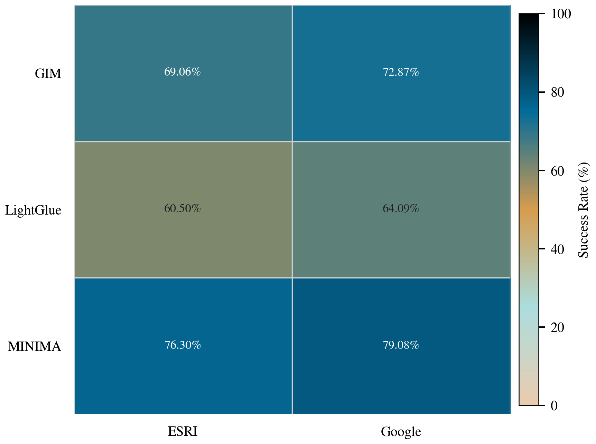
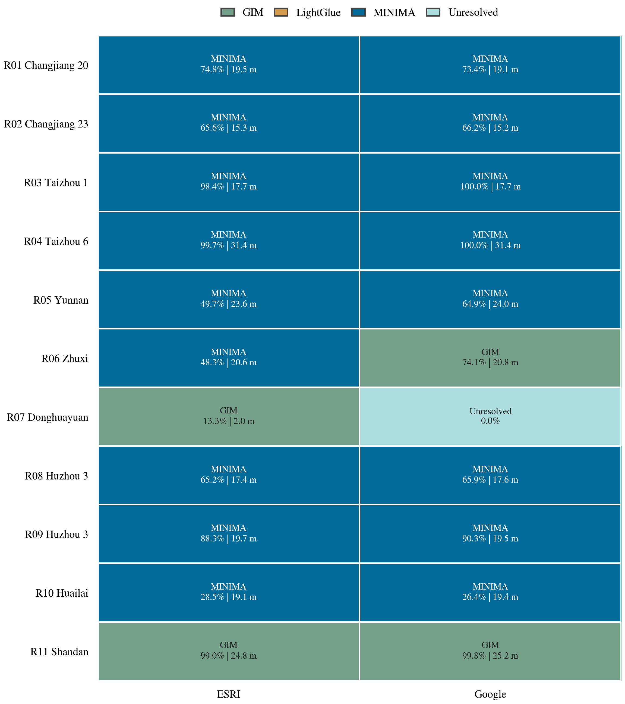

# Aerial Positioning: Visual Positioning for Aerial Imagery Using Pre-existing Satellite Images

This repository presents a visual positioning pipeline for estimating the horizontal position (latitude and longitude) of an aerial platform in GNSS-denied environments. Given an initial position estimate, the method matches onboard imagery against preexisting satellite map tiles to recover coordinates from visual cues alone. To improve cross-view consistency, the pipeline uses platform attitude information to rectify oblique camera views into a nadir-oriented perspective aligned with the satellite imagery.

> **Note:** A companion paper is currently in preparation. Detailed benchmark analysis, supplementary figures, and extended result tables will be released alongside the paper. Per-region evaluation videos with the MINIMA matcher are available in [this playlist](https://www.youtube.com/playlist?list=PL1iuXNnG1vnMdXU7XmagU-2MMkmULcEcU).

<p align="center">
  <a href="https://www.youtube.com/playlist?list=PL1iuXNnG1vnMdXU7XmagU-2MMkmULcEcU">
    
  </a>
</p>

## Table of Contents
- [Environment Setup and Usage](#environment-setup-and-usage)
- [Methodology](#methodology)
- [Evaluation Setup](#evaluation-setup)
- [Results](#results)
- [Limitations and Future Work](#limitations-and-future-work)
- [License](#license)
- [References & Acknowledgments](#references--acknowledgments)

## Environment Setup and Usage

### 1. Environment Setup

Use Python 3.9 with the dependencies listed in `requirements.txt`. For full matcher support, clone with `--recursive` because the repository includes matcher submodules. The default root configuration in `config.yaml` uses the `minima` matcher, while the codebase also supports `gim`, `lightglue`, `loftr`, and `orb`.

```bash
git clone https://github.com/hamitbugrabayram/AerialPositioning.git
cd AerialPositioning
git submodule update --init --recursive
conda create -n aerial-pos python=3.9
conda activate aerial-pos
pip install -r requirements.txt
```

For `gim`, `lightglue`, `loftr`, and `minima`, download the required weights into the paths referenced under `matcher_weights` in `config.yaml` before running evaluation. The `orb` baseline does not require pretrained weights.

### 2. Dataset and Directory Layout

The default setup uses the **[UAV-VisLoc dataset](https://github.com/IntelliSensing/UAV-VisLoc)**. After downloading the archive, extract raw data under `_VisLoc_dataset/` by running:

```bash
unzip UAV_VisLoc_dataset.zip -d _VisLoc_dataset
```

Then run the preparation step to build unified region folders under `datasets/`.

Expected layout after preparation:

```text
datasets/
├── 01_Changjiang_20/
│   ├── query/                
│   └── map/
│       ├── esri/
│       │   └── 16/
│       └── google/
├── ...
```

### 3. Standard Evaluation Commands

```bash
# Prepare all regions (both providers)
python runner.py --dataset-prepare all --tile-provider google esri

# Evaluate selected region(s)
python runner.py --dataset-eval 5 --tile-provider google esri

# Optional: force a specific zoom
python runner.py --dataset-eval 11 --zoom-levels 16 --tile-provider google esri

# Sync missing tiles with a larger map margin (meters)
python runner.py --dataset-prepare 1 2 5 11 --tile-provider google esri --map-margin 5000

# Aggregate reports
python runner.py --eval-results all
```

`--zoom-levels` is optional for both prepare and eval. If omitted, `runner.py` selects an operating zoom from each region's median altitude and latitude. During evaluation, if that zoom is not available on disk, the nearest downloaded zoom is used.

## Methodology

### Pipeline Overview
*   **Offline Tile Retrieval:** A multi-provider retrieval module pre-downloads and caches georeferenced tiles (ESRI/Google) before runtime.
*   **Query Preprocessing:** Drone images are resized and perspective-warped to a nadir, north-oriented view using only onboard attitude/gimbal telemetry (roll, pitch, yaw).
*   **Adaptive Tile Stitching:** Neighbouring satellite tiles are composed into an `N x N` grid based on barometric altitude and zoom level so the reference image covers the drone's estimated ground footprint.
*   **Synthetic INS Drift-Guided Adaptive Search:** A synthetic INS trajectory propagates the search center along the drone's trajectory using GT-derived displacement vectors as a proxy for IMU dead-reckoning. Each frame is tried once; on failure it is skipped and the search radius grows according to the configured penalty; on success the synthetic INS snaps to the visual fix and the radius resets.
*   **Feature Matching and Geometric Validation:** Correspondences from the selected matcher backend are evaluated with RANSAC and geometric plausibility constraints.

### 1. Offline Tile Retrieval
Satellite maps are downloaded before execution. A decoupled tile retrieval engine supports multiple providers (ESRI, Google), enabling high-resolution tiles for the region of interest to be cached in advance and served without live network access during positioning.

### 2. Query Preprocessing (Perspective Rectification)
Oblique UAV imagery is rectified to a nadir (top-down), north-facing view to establish geometric comparability with ortho-rectified satellite tiles.

The preprocessing pipeline uses **only onboard telemetry**:

1. **Resize** to a standard dimension (longest side 1024 px).
2. **Perspective warp** using the prepared telemetry-derived orientation fields:
   - **Yaw**: `Phi1` (stored as `Gimball_Yaw`, with runtime fallback to `Phi2` if needed).
   - **Pitch**: `-90° + Omega`.
   - **Roll**: `Kappa`.

Since calibrated camera intrinsics are not available in the dataset, the intrinsic matrix is approximated from the image dimensions as:

$$
\mathbf{K} =
\begin{bmatrix}
f & 0 & c_x \\
0 & f & c_y \\
0 & 0 & 1
\end{bmatrix},
\qquad
f = \max(w, h),
\qquad
(c_x, c_y) = \left(\frac{w}{2}, \frac{h}{2}\right).
$$

The rectifying homography is then:

$$
\mathbf{H}_{\mathrm{warp}} = \mathbf{K}\,\mathbf{R}_{\mathrm{current}}^{\top}\,\mathbf{R}_{\mathrm{nadir}}\,\mathbf{K}^{-1}.
$$

The rotation terms are

$$
\mathbf{R}_{\mathrm{current}} = \mathbf{R}(\text{measured gimbal Euler angles}),
$$

$$
\mathbf{R}_{\mathrm{nadir}} = \mathbf{R}(\text{yaw}=0^\circ,\ \text{pitch}=-90^\circ,\ \text{roll}=0^\circ).
$$

### 3. Adaptive Tile Stitching
A single `256 x 256` satellite tile may not cover the drone's full field of view, especially at high altitudes. The engine computes an adaptive grid size from:

- **Barometric altitude** and a coverage factor.
- **Map tile latitude** (from the tile's own georeferencing).
- **Zoom level** (determines tile ground resolution).

Let the single-tile ground coverage be

$$
t(\phi, z) = 256\,r(\phi, z),
$$

where $r(\phi, z)$ is the Web Mercator ground resolution in metres per pixel. The required grid size is computed as

$$
n = \left\lceil \frac{h\,c}{t(\phi, z)} \right\rceil,
\qquad
g = \min\bigl(g_{\max}, \max(1, n)\bigr).
$$

In the implementation, even values are promoted to the next odd integer so the stitched map remains centered on the reference tile. In the current root configuration, `max_grid` is `3` (fallback default: `5`). Here, $g$ is the grid dimension in tiles, $h$ is the barometric altitude, $c$ is the coverage factor, $\phi$ is latitude, and $z$ is zoom level.

With `max_grid=3`, the composite is `768 x 768` px (`3 x 3` tiles), which aligns with the standard resize target used in the benchmark and preserves detail. Missing edge tiles are filled with neutral gray.

### 4. Automatic Zoom Selection
When `--zoom-levels` is omitted, zoom is selected automatically with:

$$
z_{\mathrm{base}} = \left\lfloor \log_2\!\left(\frac{\cos(\phi)\,2\pi R\,g_{\max}}{h\,c}\right) \right\rfloor,
$$

where $\phi$ is latitude, $R$ is the Earth radius, and $h$, $c$, and $g_{\max}$ are defined as above.

For high-altitude sequences, a detail floor is also enforced through the meters-per-pixel constraint

$$
z_{\mathrm{detail}} = \left\lceil \log_2\!\left(\frac{\cos(\phi)\,2\pi R}{256\,d_{\min}}\right) \right\rceil,
$$

and the final zoom is chosen as the larger of $z_{\mathrm{base}}$ and $z_{\mathrm{detail}}$, then clamped to the configured zoom range.

To avoid overly coarse map detail at high altitude, a detail floor is applied (`min_detail_mpp=2.0`, activated for altitude `>= 1500 m`). In the current full evaluation, the automatically selected zoom levels are:

| Region IDs | Auto Selected Zoom |
| :--- | :---: |
| 01, 02, 03, 04, 08, 09 | 18 |
| 05, 06, 07, 10 | 17 |
| 11 | 16 |

### 5. Search Strategy

Two search strategies are available through the `strategy` key under `adaptive_search` in `config.yaml`:

#### `Synthetic INS Drift`

To evaluate the robustness of the visual positioning pipeline, a synthetic INS trajectory was generated by perturbing the Ground Truth (GT) with time-correlated stochastic noise (e.g., Gauss-Markov process or Random Walk), simulating the typical drift characteristics of tactical-grade inertial sensors.

Conceptually, the synthetic INS trajectory can be expressed as

$$
\mathbf{p}_{\mathrm{syn}}(t) = \mathbf{p}_{\mathrm{GT}}(t) + \int_0^t \boldsymbol{\eta}(\tau)\,d\tau,
$$

where $\mathbf{p}_{\mathrm{GT}}(t)$ is the Ground Truth trajectory and $\boldsymbol{\eta}(t)$ denotes the stochastic drift term (bias + noise).

In the present discrete implementation, the perturbation added at each step is modeled as

$$
\Delta \mathbf{p}_t = m_t
\begin{bmatrix}
\cos \theta_t \\
\sin \theta_t
\end{bmatrix},
\qquad
\mathbf{p}_{\mathrm{syn},t} = \mathbf{p}_{\mathrm{syn},t-1} + \Delta \mathbf{p}_{\mathrm{GT},t} + \Delta \mathbf{p}_t,
$$

where $\theta_t \sim \mathcal{U}(0, 2\pi)$ is a random bearing and $\Delta \mathbf{p}_{\mathrm{GT},t}$ is the GT-derived displacement increment.

In the current implementation, the synthetic drift magnitude is controlled by the configuration parameters below:

$$
m_t = \min\bigl(|\mathcal{N}(0, \sigma^2)|, \epsilon_{\max}\bigr),
$$

In the reported experiments, $\sigma = 30\,\mathrm{m}$ and $\epsilon_{\max} = 150\,\mathrm{m}$.

Each frame is attempted **once** at the current radius around the synthetic INS-predicted position:

* **On failure:** the frame is skipped and the search radius is updated as $r_{t+1} = \min(r_t + p, r_{\max})$, while the synthetic INS continues dead-reckoning.

* **On success:** the synthetic INS state is corrected by the visual estimate and the radius is reset as $r_{t+1} = r_0$.

#### `Adaptive Radius`

A simpler baseline without synthetic INS propagation. The search center stays at the **last successfully matched position**. Each frame is attempted once:

* **On failure:** the frame is skipped and the radius grows linearly.
* **On success:** the search center moves to the matched position and the radius resets.

This mode does not use displacement vectors or synthetic INS drift modeling. It is useful for ablation studies comparing synthetic INS-aided vs. purely vision-anchored search.

#### Parameters

| Parameter | Default | Description |
| :--- | :---: | :--- |
| `strategy` | `synthetic_ins_drift` | `synthetic_ins_drift` or `adaptive_radius` |
| `initial_radius_m` | 500 | Starting search radius |
| `max_radius_m` | 1000 | Maximum allowed search radius |
| `skip_penalty_m` | 100 | Radius increase per skipped frame |
| `synthetic_ins_noise_sigma_m` | 30 | Synthetic INS drift scale parameter |
| `synthetic_ins_noise_max_m` | 150 | Synthetic INS drift hard cap |

### 6. Matcher Backend and Geometric Verification
Depending on the configuration, correspondences are produced with `GIM`, `LightGlue`, `LoFTR`, or the `MINIMA` pipeline; `ORB` is also available as a classical hand-crafted baseline. Regardless of the backend, a planar homography $\mathbf{H}$ between the query image and the reference map composite is then estimated with RANSAC. Acceptance is conditioned on a minimum inlier count together with geometric plausibility checks that reject singular, numerically unstable, or implausible transforms; this includes validating the projected query footprint area and rejecting predictions whose transformed center falls outside a relaxed map boundary.

## Evaluation Setup

The repository supports `GIM`, `LightGlue`, `LoFTR`, `MINIMA`, and `ORB`. The benchmark summary below reports `GIM`, `LightGlue`, and `MINIMA`; `LoFTR` is omitted because it produces systematic false-positive matches with kilometer-scale localization errors, and `ORB` is omitted because it yields too few reliable matches and successful localizations to support a meaningful comparison.

*   **Tile providers:** Google and ESRI.
*   **Zoom policy:** Automatic zoom selection.
*   **Map context:** Adaptive `N x N` grid stitching.
*   **Geometric acceptance:** A minimum of 50 inliers is required for a match.

## Results

### Summary Findings

*   **Evaluation scope:** The comparison covers `66` experiments = `3` matchers x `11` regions x `2` providers, corresponding to **40,632 per-frame evaluations**.
*   **Best matcher:** `MINIMA` achieves the strongest overall trade-off with **77.69%** pooled success and **20.01 m** pooled median error.
*   **Best alternative:** `GIM` is the strongest non-MINIMA baseline and remains the best model in `Zhuxi-Google`, `Shandan-ESRI`, and `Shandan-Google`.
*   **Provider trend:** Google improves pooled recall from **68.62%** to **72.01%** while changing pooled median error by only **+0.07 m**.

### Overall Matcher Performance

| Matcher | Experiments | Successful Frames | Success Rate (%) | Mean Error (m) | Median Error (m) | P90 Error (m) | Mean Inliers |
| :--- | ---: | ---: | ---: | ---: | ---: | ---: | ---: |
| GIM | 22 | 9612/13544 | 70.97% | 26.41 | 20.19 | 43.54 | 322.3 |
| LightGlue | 22 | 8437/13544 | 62.29% | 23.80 | 20.06 | 42.46 | 298.1 |
| MINIMA | 22 | 10522/13544 | 77.69% | 25.52 | 20.01 | 41.88 | 287.1 |

### Provider-Wise Performance Summary

| Matcher | ESRI Success Rate (%) | Google Success Rate (%) | Delta (pp) | ESRI Median Error (m) | Google Median Error (m) | Delta (m) |
| :--- | ---: | ---: | ---: | ---: | ---: | ---: |
| GIM | 69.06% | 72.87% | +3.81 | 20.09 m | 20.29 m | +0.19 |
| LightGlue | 60.50% | 64.09% | +3.59 | 20.00 m | 20.09 m | +0.10 |
| MINIMA | 76.30% | 79.08% | +2.78 | 20.01 m | 20.00 m | -0.01 |

<p align="center">
  <strong>Provider-by-Matcher Success Rate Matrix</strong><br><br>
  
</p>

<p align="center">
  <strong>Best Matcher by Region and Provider</strong><br><br>
  
</p>

These summary views show that `MINIMA` dominates most region-provider cells, while Google consistently improves recall for all three reported matchers with negligible changes in median localization error.

## Limitations and Future Work

### Current Limitations
*   **Initial Position Requirement:** The system requires a known starting coordinate to initialize the search center.
*   **Planar Scene Assumption:** Homography-based localization is most reliable when local scene geometry is approximately planar.
*   **Map Dependency:** Performance depends on satellite-tile quality, seasonal consistency, and provider-specific appearance.

### Future Work
*   **Full EKF Integration:** Tightly/loosely coupled fusion of visual position fixes with IMU and barometric measurements in a unified state estimator.
*   **DTED-Assisted 3D Geolocation (PnP):** Incorporate DTED/elevation priors and solve a Perspective-n-Point (PnP) problem to estimate full geodetic state (`latitude`, `longitude`, `altitude`) instead of horizontal position only.
*   **Model Optimization and Edge Deployment:** Quantization/pruning and export to ONNX/TensorRT for embedded real-time deployment.

## License

This project is licensed under the MIT License.

## References & Acknowledgments
1. **[UAV-VisLoc Dataset](https://github.com/IntelliSensing/UAV-VisLoc):** Dataset source.
2. **[WildNav](https://github.com/TIERS/wildnav):** Visual navigation concept.
3. **[Visual Localization](https://github.com/TerboucheHacene/visual_localization):** Vision-based GNSS-free localization concept.
4. **Feature Matchers:** [GIM](https://github.com/xuelunshen/gim), [LightGlue](https://github.com/cvg/LightGlue), [LoFTR](https://github.com/zju3dv/LoFTR), [MINIMA](https://github.com/LSXI7/MINIMA).
5. **Classical Baseline:** [ORB (OpenCV)](https://docs.opencv.org/4.x/db/d95/classcv_1_1ORB.html).
6. **Satellite Imagery Providers:** ESRI World Imagery, Google Maps.
