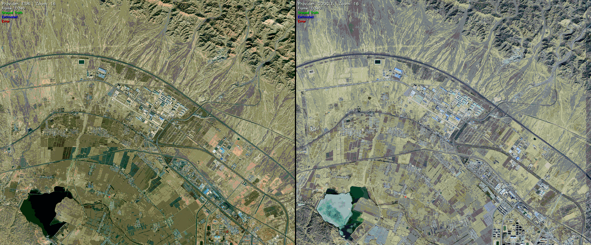
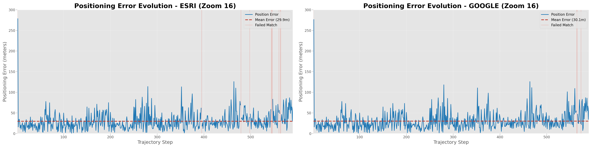

# Aerial Positioning: Visual Positioning for Aerial Imagery Using Pre-existing Satellite Images
*Capstone Project | B.Sc. in Astronautical Engineering*

This repository presents a vision-based positioning pipeline intended as a complementary aiding source for inertial navigation systems (INS) in GNSS-denied environments. The method estimates the horizontal position (latitude and longitude) of an aerial platform by matching onboard imagery against pre-existing satellite map tiles. The resulting visual position estimates can be used as periodic corrections to limit INS drift over time. To improve cross-view consistency, the pipeline uses vehicle attitude information to rectify oblique camera views into a nadir-oriented perspective aligned with satellite imagery.

<p align="center">
  
  <br>
  <i>GNSS-Free Coordinate Estimation: Ground Truth (Orange) vs. Estimated Position (Blue)</i>
</p>

## Table of Contents
- [Quick Start](#quick-start)
- [Reproducibility](#reproducibility)
- [Methodology](#methodology)
- [Experimental Setup](#experimental-setup)
- [Results](#results)
- [Limitations and Future Work](#limitations-and-future-work)
- [References & Acknowledgments](#references--acknowledgments)

## Quick Start

The commands below reproduce a standard benchmark run (Region 11, ESRI, zoom level 16).

```bash
# 1) Clone with submodules
git clone --recursive https://github.com/hamitbugrabayram/AerialPositioning.git
cd AerialPositioning

# 2) Create environment
conda create -n aerialpos python=3.9 -y
conda activate aerialpos
pip install -r requirements.txt

# 3) Download matcher weights (example: MINIMA)
cd matchers/MINIMA/weights && bash download.sh && cd ../../..

# 4) Download UAV-VisLoc dataset:
#    https://github.com/IntelliSensing/UAV-VisLoc
#    Then extract it:
unzip UAV_VisLoc_dataset.zip -d _VisLoc_dataset

# 5) Prepare dataset/maps for the selected setting
python runner.py --dataset-prepare 11 --zoom-levels 16 --tile-provider esri

# 6) Run trajectory evaluation
python runner.py --dataset-eval 11 --zoom-levels 16 --tile-provider esri

# 7) Generate summary report
python runner.py --eval-summary 11
```

## Reproducibility

### 1. Environment Setup

Use Python 3.9 with dependencies from `requirements.txt`. For complete matcher support, clone with `--recursive` and download the required model weights.

### 2. Dataset and Directory Layout

The default benchmark uses the **[UAV-VisLoc dataset](https://github.com/IntelliSensing/UAV-VisLoc)**. After downloading the archive, extract raw data under `_VisLoc_dataset/` by running:

```bash
unzip UAV_VisLoc_dataset.zip -d _VisLoc_dataset
```

Then run the preparation step to build unified region folders under `datasets/`.

Expected layout after preparation:

```text
datasets/
├── 01_Changjiang_20/
│   ├── query/                # UAV images + unified metadata
│   └── map/
│       ├── esri/
│       │   └── 16/
│       └── google/
├── ...
```

### 3. Standard Evaluation Commands

```bash
# Prepare all regions for multiple providers and zoom levels
python runner.py --dataset-prepare all --zoom-levels 16 17 --tile-provider esri google

# Evaluate selected region(s)
python runner.py --dataset-eval 11 --zoom-levels 16 --tile-provider esri

# Aggregate reports
python runner.py --eval-summary all
```

### 4. Key Configuration Parameters

Core experimental parameters are defined in `config.yaml`:

```yaml
positioning_params:
  min_inliers_for_success: 50
  sample_interval: 1
  radius_levels: [1000.0, 2000.0, 3000.0]
```

Additional controls (matcher type, thresholds, model weights, preprocessing) are also specified in `config.yaml`.

## Methodology

### Pipeline Overview
*   **Offline Tile Retrieval:** A multi-provider retrieval module pre-downloads and caches georeferenced tiles (ESRI/Google) before runtime.
*   **Perspective Rectification:** Oblique UAV frames are transformed into nadir-view imagery using camera intrinsics and vehicle attitude (roll/pitch/yaw).
*   **Displacement Propagation:** In trajectory evaluation, the next search center is propagated via frame-to-frame ground-truth displacement and corrected by successful visual matches.
*   **Adaptive Search Radius:** Candidate-map filtering expands progressively (1000 m → 2000 m → 3000 m) when matching is unsuccessful.
*   **Deep Matching and Geometric Validation:** Transformer-based correspondences (e.g., LoFTR/GIM) are validated through RANSAC and geometric plausibility constraints.

### 1. Offline Tile Retrieval
Satellite maps are downloaded offline prior to execution. A decoupled tile retrieval engine supports multiple providers (ESRI, Google), enabling high-resolution tiles for the region of interest to be cached in advance and served without live network access during positioning.

### 2. Perspective Warping (Nadir Transformation)
Oblique UAV imagery is rectified to a nadir (top-down) view to establish geometric comparability with ortho-rectified satellite tiles. The warp homography is derived from camera intrinsics $K$ and vehicle attitude $R_{AV}$ (roll, pitch, yaw), with a target rotation $R_{nadir}$ that aligns the view with the world vertical:
$$H_{warp} = K \cdot R_{AV}^T \cdot R_{nadir} \cdot K^{-1}$$
Adaptive yaw selects the in-plane rotation that minimizes resampling artifacts while preserving valid image coverage.

### 3. Displacement Propagation (INS/Odometry Proxy in Evaluation)
During trajectory evaluation, the next search center is propagated from the last visual state using frame-to-frame displacement derived from query metadata (latitude/longitude ground-truth differences), rather than from live IMU integration:
$$\hat{p}_i = p^{fix}_{i-1} + \left(p^{GT}_i - p^{GT}_{i-1}\right)$$
With `sample_interval=1`, displacement is computed between consecutive frames. If visual matching succeeds, the state is corrected using the updated visual estimate (`predicted_latitude`, `predicted_longitude`); if matching fails, the propagated center is retained. Candidate satellite tiles are then filtered around this reference point using adaptive radii (1000 m → 2000 m → 3000 m).

### 4. Deep Matching and Geometric Verification
Dense or semi-dense correspondences are computed using deep transformer-based matchers (e.g., LoFTR, GIM). A planar homography $H$ between query and reference tile is then estimated via RANSAC. Acceptance is conditioned on stability checks, including a determinant constraint ($|\det H| \approx 1$) for near-rigid behavior, image-boundary consistency of projected corners, and non-degeneracy of the estimated transformation.

## Experimental Setup

The results reported below correspond to the following setup:

*   **Dataset:** UAV-VisLoc, Region 11 (Shandan).
*   **Matcher Backend:** GIM (LightGlue variant).
*   **Tile Providers:** ESRI and Google.
*   **Zoom Levels:** 15 and 16.
*   **Temporal Sampling:** `sample_interval=1` (all 590 frames evaluated).
*   **Search Strategy:** `radius_levels=[1000, 2000, 3000]`.
*   **Geometric Acceptance:** `min_inliers_for_success=50`.

## Results

| Region (ID) | Provider | Zoom | Success Rate | Avg Error | Avg Inliers |
| :--- | :--- | :--- | :--- | :--- | :--- |
| **Shandan (11)** | **ESRI** | **15** | **70.51%** | **29.84m** | **354.6** |
| **Shandan (11)** | **Google** | **15** | **74.75%** | **30.96m** | **342.2** |
| **Shandan (11)** | **ESRI** | **16** | **98.31%** | **29.89m** | **521.8** |
| **Shandan (11)** | **Google** | **16** | **99.32%** | **30.08m** | **538.9** |

### Zoom 16 Error Evolution
<p align="center">
  
</p>

### Key Findings
*   **Highest Observed Success Rate:** The best configuration was Google at zoom level 16, achieving **99.32%** success across 590 frames.
*   **Zoom-Level Effect:** Both providers exhibit substantial performance gains from zoom 15 to zoom 16.
*   **Provider Comparison at Zoom 16:** Google yields slightly higher success rate and average inlier count than ESRI.
*   **Error Magnitude:** Mean positioning error remains close to **30 m** across all evaluated configurations.

## Limitations and Future Work

### Current Limitations
*   **Evaluation-Time Motion Proxy:** Displacement propagation relies on frame-to-frame ground-truth metadata differences during evaluation and does not represent a live IMU-driven navigation solution.
*   **Planar Scene Assumption:** Homography-based localization is most reliable when local scene geometry is approximately planar.
*   **Map Dependency:** Performance depends on satellite-tile quality, seasonal consistency, and provider-specific appearance.

### Future Work
*   **Full EKF Integration:** Tightly/loosely coupled fusion of visual position fixes with IMU and barometric measurements in a unified state estimator.
*   **Adaptive Zoom Selection:** Automatic zoom-level selection from altitude and camera intrinsics to preserve GSD consistency.
*   **DTED-Assisted 3D Geolocation (PnP):** Incorporate DTED/elevation priors and solve a Perspective-n-Point (PnP) problem to estimate full geodetic state (`latitude`, `longitude`, `altitude`) instead of horizontal position only.
*   **Model Optimization and Edge Deployment:** Quantization/pruning and export to ONNX/TensorRT for embedded real-time deployment.

## References & Acknowledgments
1. **[UAV-VisLoc Dataset](https://github.com/IntelliSensing/UAV-VisLoc):** Dataset source.
2. **[WildNav](https://github.com/TIERS/wildnav):** Visual navigation concept.
3. **[Visual Localization](https://github.com/TerboucheHacene/visual_localization):** Vision-based GNSS-free localization concept.
4. **Deep Matchers:** [GIM](https://github.com/xuelunshen/gim), [LightGlue](https://github.com/cvg/LightGlue), [LoFTR](https://github.com/zju3dv/LoFTR), [MINIMA](https://github.com/LSXI7/MINIMA).
5. **Satellite Imagery Providers:** ESRI World Imagery, Google Maps.

---
*Developed as a B.Sc. Graduation Project.*
