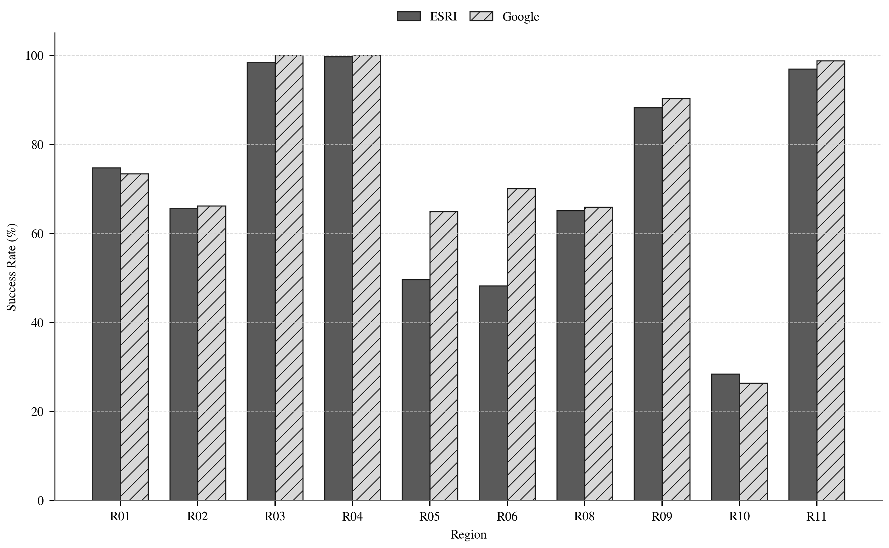
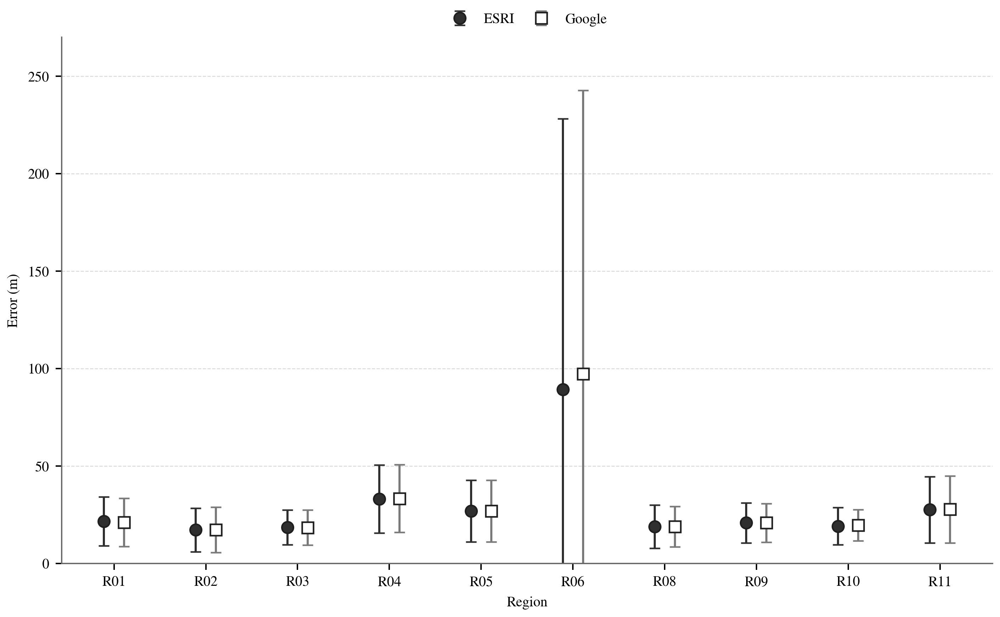
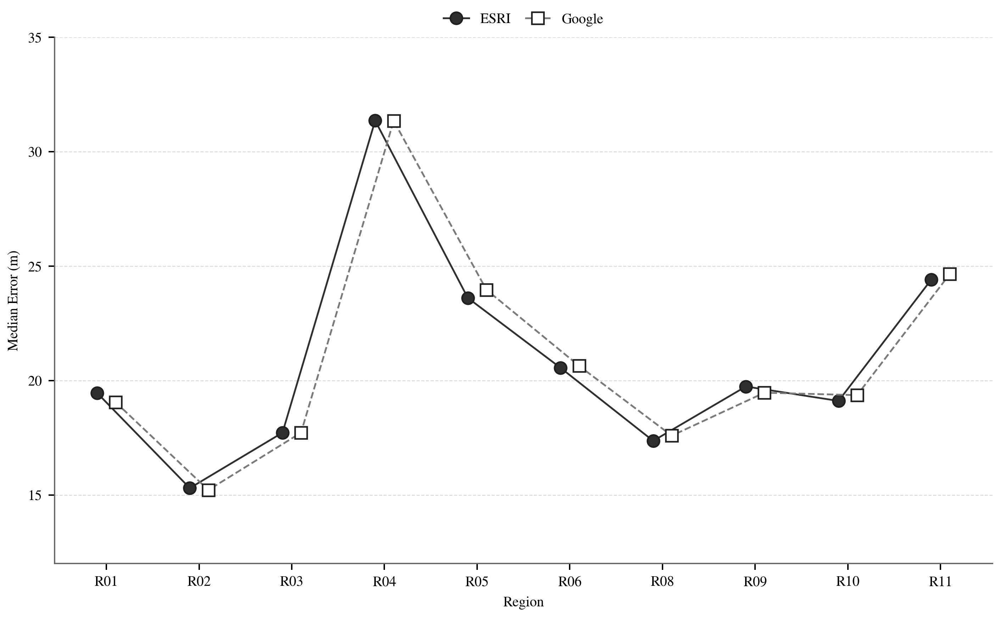

# Aerial Positioning: Visual Positioning for Aerial Imagery Using Pre-existing Satellite Images
*Developed as a Capstone Project | B.Sc. in Astronautical Engineering*

This repository presents a vision-based positioning process for estimating the horizontal position (latitude and longitude) of an aerial platform in GNSS-denied environments. Given only an initial starting position, the method matches onboard imagery against pre-existing satellite map tiles to produce coordinate estimates purely from visual information. To improve cross-view consistency, the process uses aerial vehicle attitude information to rectify oblique camera views into a nadir-oriented perspective aligned with satellite imagery.

<p align="center">
  <a href="https://www.youtube.com/playlist?list=PL1iuXNnG1vnMdXU7XmagU-2MMkmULcEcU">
    
  </a>
</p>

## Table of Contents
- [Environment Setup and Usage](#environment-setup-and-usage)
- [Methodology](#methodology)
- [Evaluation Setup](#evaluation-setup)
- [Results](#results)
- [Limitations and Future Work](#limitations-and-future-work)
- [References & Acknowledgments](#references--acknowledgments)

## Environment Setup and Usage

### 1. Environment Setup

Use Python 3.9 with dependencies from `requirements.txt`. For complete matcher support, clone with `--recursive` because the repository includes matcher submodules. The current default configuration in `config.yaml` uses the `minima` matcher, while the codebase also supports `lightglue`, `loftr`, and `gim`.

```bash
git clone --recursive REPO_URL
cd AerialPositioning
python -m venv .venv
source .venv/bin/activate
pip install -r requirements.txt
```

Download the required matcher weights into the paths referenced under `matcher_weights` in `config.yaml` before running evaluation.

### 2. Dataset and Directory Layout

The default setup uses the **[UAV-VisLoc dataset](https://github.com/IntelliSensing/UAV-VisLoc)**. After downloading the archive, extract raw data under `_VisLoc_dataset/` by running:

```bash
unzip UAV_VisLoc_dataset.zip -d _VisLoc_dataset
```

Then run the preparation step to build unified region folders under `datasets/`.

Expected layout after preparation:

```text
datasets/
├── 01_Changjiang_20/
│   ├── query/                
│   └── map/
│       ├── esri/
│       │   └── 16/
│       └── google/
├── ...
```

### 3. Standard Evaluation Commands

```bash
# Prepare all regions (both providers)
python runner.py --dataset-prepare all --tile-provider google esri

# Evaluate selected region(s)
python runner.py --dataset-eval 5 --tile-provider google esri

# Optional: force a specific zoom
python runner.py --dataset-eval 11 --zoom-levels 16 --tile-provider google esri

# Sync missing tiles with a larger map margin (meters)
python runner.py --dataset-prepare 1 2 5 11 --tile-provider google esri --map-margin 5000

# Aggregate reports
python runner.py --eval-results all
```

`--zoom-levels` is optional for both prepare and eval. If omitted, `runner.py` computes an optimal zoom from each region's median altitude and latitude. During eval, if that zoom is not available on disk, the nearest downloaded zoom is used.

## Methodology

### Pipeline Overview
*   **Offline Tile Retrieval:** A multi-provider retrieval module pre-downloads and caches georeferenced tiles (ESRI/Google) before runtime.
*   **Query Preprocessing:** Drone images are resized and perspective-warped to a nadir, north-oriented view using only onboard attitude/gimbal telemetry (roll, pitch, yaw).
*   **Adaptive Tile Stitching:** Neighbouring satellite tiles are composed into an `N x N` grid based on barometric altitude and zoom level so the reference image covers the drone's estimated ground footprint.
*   **INS-Guided Adaptive Search:** A simulated INS propagates the search center along the drone's trajectory using GT-derived displacement vectors (proxy for IMU dead-reckoning) with bounded random per-step drift. Each frame is tried once; on failure it is skipped and the search radius grows according to the configured penalty; on success the INS snaps to the visual fix and the radius resets.
*   **Deep Matching and Geometric Validation:** Transformer-based correspondences are validated through RANSAC and geometric plausibility constraints.

### 1. Offline Tile Retrieval
Satellite maps are downloaded offline prior to execution. A decoupled tile retrieval engine supports multiple providers (ESRI, Google), enabling high-resolution tiles for the region of interest to be cached in advance and served without live network access during positioning.

### 2. Query Preprocessing (Perspective Rectification)
Oblique UAV imagery is rectified to a nadir (top-down), north-facing view to establish geometric comparability with ortho-rectified satellite tiles.

The preprocessing pipeline uses **only onboard telemetry**:

1. **Resize** to a standard dimension (longest side 1024 px).
2. **Perspective warp** using the prepared telemetry-derived orientation fields:
   - **Yaw**: `Phi1` (stored as `Gimball_Yaw`, with runtime fallback to `Phi2` if needed).
   - **Pitch**: `-90° + Omega`.
   - **Roll**: `Kappa`.

Since calibrated camera intrinsics are not available in the dataset, the intrinsic matrix is approximated from the image dimensions as:

$$
\mathbf{K} =
\begin{bmatrix}
f & 0 & c_x \\
0 & f & c_y \\
0 & 0 & 1
\end{bmatrix},
\qquad
f = \max(w, h),
\qquad
(c_x, c_y) = \left(\frac{w}{2}, \frac{h}{2}\right).
$$

The rectifying homography is then:

$$
\mathbf{H}_{\mathrm{warp}} = \mathbf{K}\,\mathbf{R}_{\mathrm{current}}^{\top}\,\mathbf{R}_{\mathrm{nadir}}\,\mathbf{K}^{-1}.
$$

Here, $\mathbf{R}_{\mathrm{current}}$ is formed from the measured gimbal Euler angles, while $\mathbf{R}_{\mathrm{nadir}}$ denotes the target nadir-facing orientation with `pitch = -90°`, `yaw = 0°`, and `roll = 0°`.

### 3. Adaptive Tile Stitching
A single `256 x 256` satellite tile may not cover the drone's full field of view, especially at high altitudes. The engine computes an adaptive grid size from:

- **Barometric altitude** and a coverage factor.
- **Map tile latitude** (from the tile's own georeferencing).
- **Zoom level** (determines tile ground resolution).

Let the single-tile ground coverage be

$$
t(\phi, z) = 256\,r(\phi, z),
$$

where $r(\phi, z)$ is the Web Mercator ground resolution in metres per pixel. The required grid size is computed as

$$
n = \left\lceil \frac{h\,c}{t(\phi, z)} \right\rceil,
\qquad
g = \min\bigl(g_{\max}, \max(1, n)\bigr).
$$

In the implementation, an even value is promoted to the next odd value so the stitched map stays centered on the reference tile. In practice, `max_grid` is configured as an odd integer (current root config: `3`; fallback default: `5`). Here, $g$ is the grid dimension in tiles, $h$ is the barometric altitude, $c$ is the coverage factor, $\phi$ is latitude, and $z$ is zoom level.

With `max_grid=3`, the composite is `768 x 768` px (`3 x 3` tiles), which matches the matcher's internal resize target and preserves detail. Missing edge tiles are filled with neutral gray.

### 4. Automatic Zoom Selection
When `--zoom-levels` is omitted, zoom is selected automatically with:

$$
z_{\mathrm{base}} = \left\lfloor \log_2\!\left(\frac{\cos(\phi)\,2\pi R\,g_{\max}}{h\,c}\right) \right\rfloor,
$$

where $\phi$ is latitude, $R$ is the Earth radius, and $h$, $c$, and $g_{\max}$ are defined as above.

For high-altitude sequences, a detail floor is also enforced through the meters-per-pixel constraint

$$
z_{\mathrm{detail}} = \left\lceil \log_2\!\left(\frac{\cos(\phi)\,2\pi R}{256\,d_{\min}}\right) \right\rceil,
$$

and the final zoom is chosen as the larger of $z_{\mathrm{base}}$ and $z_{\mathrm{detail}}$, then clamped to the configured zoom range.

To avoid overly coarse map detail at high altitude, a detail floor is applied (`min_detail_mpp=2.0`, activated for altitude `>= 1500 m`). In the current full evaluation, selected zoom levels are:

| Region IDs | Selected Zoom |
| :--- | :---: |
| 01, 02, 03, 04, 08, 09 | 18 |
| 05, 06, 07, 10 | 17 |
| 11 | 16 |

### 5. Search Strategy

Two search strategies are available, selected via the `strategy` key under `adaptive_search` in `config.yaml`:

#### `ins_simulation`

The search center is propagated by a **simulated INS** that uses GT-derived displacement vectors as a proxy for accelerometer/gyro integration. In a real deployment, these motion increments would be supplied by the onboard IMU. To emulate accumulated inertial drift, the implementation samples a random direction and a bounded half-normal drift magnitude:

$$
m_t = \min\bigl(|\mathcal{N}(0, \sigma^2)|, \epsilon_{\max}\bigr),
$$

then converts that magnitude into a latitude/longitude perturbation with a uniformly random bearing. In the reported experiments, $\sigma = 30\,\mathrm{m}$ and $\epsilon_{\max} = 150\,\mathrm{m}$.

Each frame is attempted **once** at the current radius around the INS-predicted position:

* **On failure:** the frame is skipped and the search radius is updated as $r_{t+1} = \min(r_t + p, r_{\max})$, while the INS continues dead-reckoning.

* **On success:** the INS state is corrected by the visual estimate and the radius is reset as $r_{t+1} = r_0$.

#### `adaptive_radius`

A simpler baseline without INS propagation. The search center stays at the **last successfully matched position**. Each frame is attempted once:

* **On failure:** the frame is skipped and the radius grows linearly.
* **On success:** the search center moves to the matched position and the radius resets.

This mode does not use displacement vectors or noise simulation. It is useful for ablation studies comparing INS-aided vs. purely vision-anchored search.

#### Parameters

| Parameter | Default | Description |
| :--- | :---: | :--- |
| `strategy` | `ins_simulation` | `ins_simulation` or `adaptive_radius` |
| `initial_radius_m` | 500 | Starting search radius |
| `max_radius_m` | 1000 | Maximum allowed search radius |
| `skip_penalty_m` | 100 | Radius increase per skipped frame |
| `ins_noise_sigma_m` | 30 | Per-step INS drift std dev |
| `ins_noise_max_m` | 150 | Per-step INS drift hard cap |

### 6. Deep Matching and Geometric Verification
Dense or semi-dense correspondences are computed using the MINIMA framework (SuperPoint + LightGlue). A planar homography $\mathbf{H}$ between the query image and the reference map composite is then estimated with RANSAC. Acceptance is conditioned on a minimum inlier count together with geometric plausibility checks that reject singular, numerically unstable, or implausible transforms; this includes validating the projected query footprint area and rejecting predictions whose transformed center falls outside a relaxed map boundary.

## Evaluation Setup

The results reported below correspond to the documented evaluation setup used for this repository snapshot:

*   **Matcher:** MINIMA (SuperPoint + LightGlue).
*   **Tile Providers:** Google and ESRI (same region set evaluated on both).
*   **Preprocessing:** Resize + gimbal warp (Phi1 as yaw, estimated K from image dims).
*   **Zoom Policy:** Auto zoom enabled (`--zoom-levels` omitted during eval).
*   **Map Context:** Adaptive `N x N` grid stitching (`coverage_factor=2.0`, `max_grid=3`).
*   **Temporal Sampling:** `sample_interval=1` (all frames evaluated).
*   **Search Strategy:** INS-guided skip-and-grow with a 500 m starting radius and logged fallback radii reported per experiment in the stored CSV outputs.
*   **Geometric Acceptance:** `min_inliers_for_success=50`.

## Results

### Overall Results

*   **Evaluation scope:** 22 experiments across 11 regions with 2 map providers.
*   **Overall success rate:** 77.69% across all 13,544 evaluated frames.
*   **Provider comparison:** Google has higher success in 8 regions, ESRI in 2 regions, and 1 region is tied.
*   **Best performance:** Region 03 and Region 04 reach 100% success with Google.
*   **Most difficult cases:** Region 07 fails for both providers; Region 10 remains low on both.
*   **Dataset caveat (Region 07):** Satellite-image generation for Region 07 produced errors, and the most likely cause is incorrect GT coordinates in the original dataset metadata.

You can watch the per-region evaluation outputs from this playlist:
[Dataset Results (Youtube)](https://www.youtube.com/playlist?list=PL1iuXNnG1vnMdXU7XmagU-2MMkmULcEcU)

### Full Evaluation — All Regions (11 regions x 2 providers)

The table below includes every evaluated region (01-11) for both tile providers.

| Region (ID) | Zoom | ESRI Success | Google Success | ESRI Median Err (m) | Google Median Err (m) | Higher Success Rate |
| :--- | :---: | :---: | :---: | ---: | ---: | :--- |
| Changjiang_20 (01) | 18 | 74.79% (611/817) | 73.44% (600/817) | 19.46 | 19.05 | ESRI |
| Changjiang_23 (02) | 18 | 65.64% (703/1071) | 66.20% (709/1071) | 15.30 | 15.22 | Google |
| Taizhou_1 (03) | 18 | 98.44% (756/768) | 100.00% (768/768) | 17.72 | 17.72 | Google |
| Taizhou_6 (04) | 18 | 99.73% (736/738) | 100.00% (738/738) | 31.36 | 31.35 | Google |
| Yunnan (05) | 17 | 49.68% (235/473) | 64.90% (307/473) | 23.61 | 23.97 | Google |
| Zhuxi (06) | 17 | 48.26% (166/344) | 70.06% (241/344) | 20.56 | 20.64 | Google |
| Donghuayuan (07) | 17 | 0.00% (0/30) | 0.00% (0/30) | N/A | N/A | N/A |
| Huzhou_3_08 (08) | 18 | 65.15% (673/1033) | 65.92% (681/1033) | 17.36 | 17.59 | Google |
| Huzhou_3_09 (09) | 18 | 88.25% (676/766) | 90.34% (692/766) | 19.74 | 19.47 | Google |
| Huailai (10) | 17 | 28.47% (41/144) | 26.39% (38/144) | 19.11 | 19.36 | ESRI |
| Shandan (11) | 16 | 96.94% (570/588) | 98.81% (581/588) | 24.41 | 24.65 | Google |

### Tile Provider Comparison

The table below reports **pooled per-frame metrics** for the two tile providers.

| Provider | Exps. | Success | Success Rate | Mean Err (m) | Median Err (m) | P90 Err (m) | Mean Inliers | Match Time (s) | Cand. Maps |
| :--- | ---: | ---: | ---: | ---: | ---: | ---: | ---: | ---: | ---: |
| esri | 11 | 5167 | 76.30% | 24.88 | 20.01 | 41.47 | 275.0 | 0.046 | 55.5 |
| google | 11 | 5355 | 79.08% | 26.13 | 20.00 | 42.34 | 298.8 | 0.048 | 63.8 |

### Summary

The publication-style figures below summarize the valid-region results. Region 07 is excluded from the plots because both providers fail completely there and the sequence is already discussed separately above.

<table>
  <tr>
    <td valign="top" width="70%">
      <strong>Success Rate by Region</strong><br><br>
      
    </td>
    <td valign="center" width="30%">
      Google reaches the higher success rate in 8 of the 10 plotted regions. The strongest gains appear in Regions 05 and 06, while ESRI keeps a slight edge in Regions 01 and 10.
    </td>
  </tr>
  <tr>
    <td valign="top" width="70%">
      <strong>Mean Error with Std by Region</strong><br><br>
      
    </td>
    <td valign="center" width="30%">
      This view emphasizes dispersion instead of only central tendency. Region 06 stands out with very large variance for both providers, indicating rare but severe outliers among otherwise successful matches.
    </td>
  </tr>
  <tr>
    <td valign="top" width="70%">
      <strong>Median Error by Region</strong><br><br>
      
    </td>
    <td valign="center" width="30%">
      Median error remains far more stable than mean error, mostly between 15 m and 25 m, with Region 04 as the main exception near 31 m. This suggests that provider choice affects recall more than typical post-match accuracy.
    </td>
  </tr>
</table>

### Observations

*   **Overall comparison:** Google has higher aggregate success rate (79.08% vs 76.30%), while median error is very close between providers.
*   **Strong regions:** Regions 03, 04, and 11 remain near-perfect (>96% on both providers).
*   **Challenging regions:** Region 07 is currently unresolved (0% for both), and Region 10 remains low-success on both providers.
*   **Region 07 status:** The current stored evaluation snapshot does not obtain any successful matches there for either provider (0/30 on both).
*   **Provider-sensitive regions:** Regions 05 and 06 show large gains with Google in success rate.
*   **Low-texture failure mode:** Sea, river, and very rural scenes remain plausible failure cases because the matcher may not recover enough reliable visual features there.

## Limitations and Future Work

### Current Limitations
*   **Initial Position Requirement:** The system requires a known starting coordinate to initialize the search center.
*   **Planar Scene Assumption:** Homography-based localization is most reliable when local scene geometry is approximately planar.
*   **Map Dependency:** Performance depends on satellite-tile quality, seasonal consistency, and provider-specific appearance.

### Future Work
*   **Full EKF Integration:** Tightly/loosely coupled fusion of visual position fixes with IMU and barometric measurements in a unified state estimator.
*   **DTED-Assisted 3D Geolocation (PnP):** Incorporate DTED/elevation priors and solve a Perspective-n-Point (PnP) problem to estimate full geodetic state (`latitude`, `longitude`, `altitude`) instead of horizontal position only.
*   **Model Optimization and Edge Deployment:** Quantization/pruning and export to ONNX/TensorRT for embedded real-time deployment.

## References & Acknowledgments
1. **[UAV-VisLoc Dataset](https://github.com/IntelliSensing/UAV-VisLoc):** Dataset source.
2. **[WildNav](https://github.com/TIERS/wildnav):** Visual navigation concept.
3. **[Visual Localization](https://github.com/TerboucheHacene/visual_localization):** Vision-based GNSS-free localization concept.
4. **Deep Matchers:** [GIM](https://github.com/xuelunshen/gim), [LightGlue](https://github.com/cvg/LightGlue), [LoFTR](https://github.com/zju3dv/LoFTR), [MINIMA](https://github.com/LSXI7/MINIMA).
5. **Satellite Imagery Providers:** ESRI World Imagery, Google Maps.
